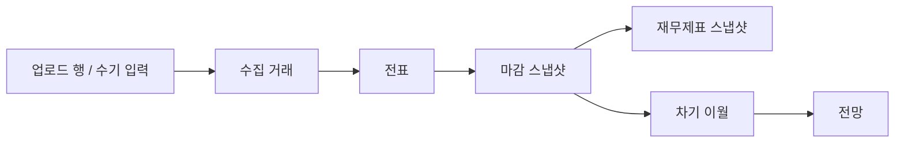
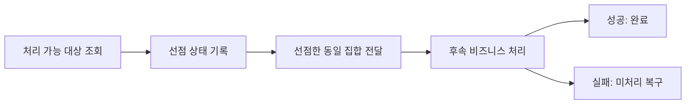
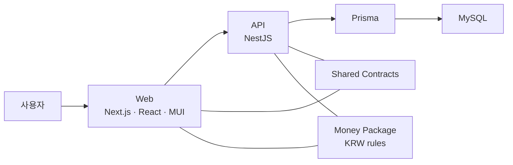
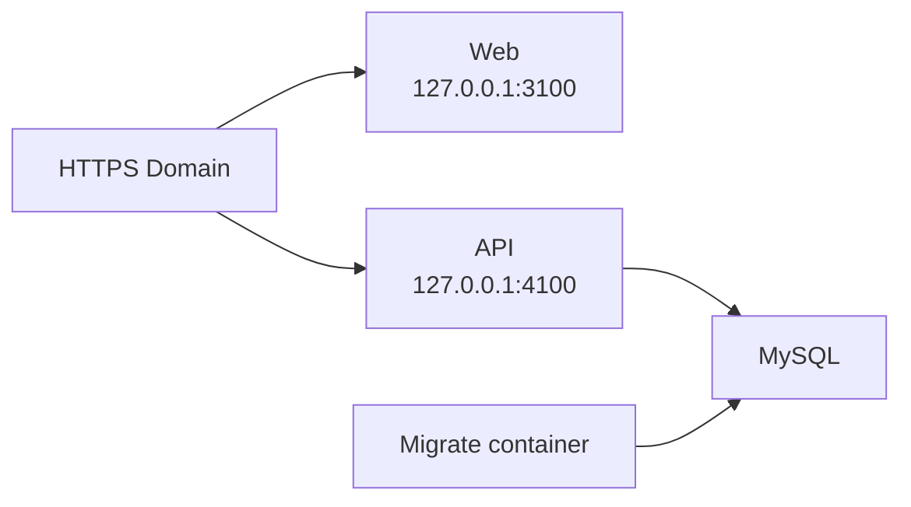

# PERSONAL_ERP 포트폴리오 PPT 제작 설계서

이 문서는 저장소 안에서만 읽는 문서가 아니라, 별도 PowerPoint/PDF 포트폴리오를 만들기 위한 제작 설계서입니다.
완성 PPT는 저장소와 완전히 연결되어 있지 않아도 이해되어야 하므로, 본문은 자급자족형 설명과 화면 캡처 중심으로 구성합니다.
저장소 링크와 코드 경로는 발표자 노트, 부록, 검증 근거로만 사용합니다.

## 제작 원칙

### PPT가 독립적으로 이해되어야 한다

- 슬라이드 본문에는 저장소 상대 경로나 긴 링크를 넣지 않습니다.
- 각 화면 캡처에는 `무엇을 보는 화면인지`, `사용자가 어떤 판단을 하는지`, `구현상 어떤 의미가 있는지`를 짧게 붙입니다.
- 코드는 직접 보여주기보다 아키텍처, 도메인 경계, 검증 체계로 요약합니다.
- 링크는 마지막 부록 또는 QR 영역에만 둡니다.
- Deep Research 인용 토큰 형식은 PPT와 이 문서에 사용하지 않습니다.

### 요즘 포트폴리오 톤에 맞춘다

요즘 개발/제품 포트폴리오는 화면을 많이 나열하는 것보다, `문제 -> 판단 -> 구현 -> 결과/근거`가 보이게 만드는 쪽이 강합니다.
스크린샷은 주인공이 아니라 증거입니다.
따라서 이 PPT는 아래 질문에 답해야 합니다.

1. 어떤 문제를 풀었나?
2. 왜 이런 도메인 모델과 구조를 선택했나?
3. 실제 제품 화면에서 그 판단이 어떻게 드러나나?
4. 구현이 끝났다는 근거는 무엇인가?
5. 운영, 보안, 검증까지 어느 정도 생각했나?
6. 아직 무엇을 보완할 계획인가?

## PPT 권장 분량

| 용도        | 권장 장수 | 설명                                                                          |
| ----------- | --------: | ----------------------------------------------------------------------------- |
| 면접 발표용 |   15~18장 | 10~15분 발표에 적합합니다. 화면 캡처는 핵심 화면 위주로 넣습니다.             |
| PDF 제출용  |   20~34장 | 저장소를 보지 않아도 전체 맥락이 이해되게 화면 설명과 근거를 충분히 넣습니다. |
| 부록 포함본 |   25~35장 | API, 검증 명령, 배포 구성, 추가 화면 캡처를 부록으로 둡니다.                  |

이 프로젝트는 도메인과 화면 흐름, 실무 ERP 유지보수 경험, 실무 기반 정합성 설계, SaaS ERP 아키텍처 판단이 강점이므로, 최종 PDF 제출용은 **30~34장 내외**가 적절합니다.

실제 생성본은 화면 설명, 운영 자산, 실무 ERP 유지보수 관점, 정합성/트랜잭션 처리 근거, 실무 선점 설계 사례, 아키텍처 판단을 더 충분히 담기 위해 **34장 구성**으로 제작했습니다.
발표 시간이 짧으면 화면 슬라이드 일부를 숨기고, PDF 제출용은 전체 34장을 사용하는 방식이 좋습니다.

## 핵심 메시지

### 한 줄 정의

`PERSONAL_ERP`는 1인 사업자와 소상공인이 매달 반복하는 재무 운영을 기준 데이터 준비, 계획 생성, 거래 수집, 전표 확정, 월 마감, 재무제표, 차기 이월, 다음 달 전망까지 한 흐름으로 닫는 월별 재무 운영 ERP입니다.

### 발표에서 반복할 문장

- 거래 기록 앱이 아니라 월 운영을 닫는 ERP입니다.
- ERP 유지보수에서 반복적으로 마주친 기준정보, 상태 추적, 마감, 감사 문제를 제품 구조로 풀었습니다.
- 수집 거래와 전표를 분리해 검토 입력과 공식 회계 기록을 나눴습니다.
- Next.js, NestJS, MUI 선택은 유지보수, 확장, AI 협업 가능한 모듈 경계를 만들기 위한 결정입니다.
- 화면, API, 문서, 검증, 배포가 한 방향으로 맞물리도록 구성했습니다.
- 개인 프로젝트지만 운영 배포와 보안 기준까지 설명 가능한 형태로 정리했습니다.

### 보여줘야 할 역량

| 역량                 | PPT에서 보여줄 증거                                                                      |
| -------------------- | ---------------------------------------------------------------------------------------- |
| 도메인 모델링        | 수집 거래, 전표, 마감 스냅샷, 재무제표, 차기 이월 경계                                   |
| ERP 유지보수 경험    | 기준정보 우선, 상태 추적, 예외 노출, 반전/정정, 권한/감사 로그                           |
| 정합성/트랜잭션 처리 | 실무 선점 설계 경험, 전표 확정 트랜잭션 경계, 운영월별 전표 순번, 동시성 방어, 실패 격리 |
| 풀스택 구현          | Next.js Web, NestJS API, Prisma, MySQL, shared contracts                                 |
| 아키텍처 설계        | SaaS ERP 구조, Next.js/NestJS 모듈 경계, MUI 기반 UI 일관성, AI 협업 친화성              |
| 제품 사고            | 공개 홈, 데모 계정, 월 운영 시나리오, 화면별 사용자 판단                                 |
| 품질 관리            | 문서 검사, 브라우저 스모크, 실DB 통합 검증, 금액 규칙 검사, 런타임 보안 점검             |
| 운영 인식            | Docker 개인 서버 배포, 운영 compose, Dynu DDNS, Caddy HTTPS, 환경값/비밀값 분리          |
| 통신 이해            | 개인 서버 Docker 배포, Dynu DDNS, Caddy HTTPS, DB 서버 간 연결/방화벽/DTC/RPC 이슈 이해  |
| 정직한 범위 관리     | 라이선스, 프록시 설정 파일, 최신 보안 점검 로그 등 보완점 명시                           |

## 추천 슬라이드 구성

### 1. 표지

**제목**
PERSONAL_ERP

**부제**
1인 사업자와 소상공인의 월별 재무 운영을 한 흐름으로 닫는 ERP

**시각자료**
공개 홈 히어로 또는 대시보드 대표 캡처

**화면 설명**
첫 장은 제품이 실제로 존재한다는 인상을 주는 장입니다.
저장소 설명보다 제품 화면을 먼저 보여주고, 프로젝트명을 크게 둡니다.

### 2. 프로젝트 요약

| 항목      | 내용                                                                                          |
| --------- | --------------------------------------------------------------------------------------------- |
| 대상      | 1인 사업자, 소상공인, 소규모 운영자                                                           |
| 핵심 문제 | 거래, 계획, 확정 회계 기록, 마감, 보고가 흩어짐                                               |
| 해결 방향 | 월 운영 사이클을 하나의 제품 흐름으로 연결                                                    |
| 구현 범위 | 공개 홈, 인증, 기준 데이터, 계획, 수집 거래, 전표, 마감, 재무제표, 이월, 전망, 운영/관리 화면 |
| 기술 스택 | Next.js, React, MUI, NestJS, Prisma, MySQL                                                    |

**말할 내용**
프로젝트를 가계부나 단순 장부가 아니라 `월별 재무 운영 시스템`으로 정의합니다.
면접관이 이후 화면을 볼 때 같은 기준으로 해석할 수 있게 만드는 장입니다.

### 3. 해결하려는 문제

| 문제                    | 사용자가 겪는 어려움                                      | 프로젝트의 대응                              |
| ----------------------- | --------------------------------------------------------- | -------------------------------------------- |
| 거래가 흩어짐           | 통장, 카드, 수기 입력, 업로드 파일이 따로 움직임          | 업로드 배치와 수집 거래로 입력을 모음        |
| 계획과 실제가 끊김      | 예상 지출과 실제 거래를 연결하기 어려움                   | 반복 규칙, 계획 항목, 수집 거래, 전표를 연결 |
| 공식 숫자가 불명확함    | 어떤 거래가 확정됐고 어떤 달이 마감됐는지 설명하기 어려움 | 전표와 마감 스냅샷 기준으로 보고             |
| 다음 달 준비가 수동적임 | 마감 이후 이월과 전망이 따로 관리됨                       | 차기 이월과 전망으로 다음 월 운영 연결       |

**시각자료**
문제/해결 2열 카드 또는 간단한 before/after 다이어그램

### 4. ERP 유지보수 경험을 반영한 설계 기준

| 실무에서 느낀 문제                                        | PPT에서 보여줄 설계 기준                                           |
| --------------------------------------------------------- | ------------------------------------------------------------------ |
| 기준정보가 흔들리면 이후 거래, 보고, 마감까지 같이 흔들림 | 거래 입력 전 자금수단, 카테고리, 계정 기준과 준비 상태를 먼저 확인 |
| 처리 상태가 보이지 않으면 현업 문의와 장애 대응이 어려움  | 검토 필요, 처리 중, 확정, 마감, 예외 상태를 화면에 드러냄          |
| 확정 데이터를 덮어쓰면 원인 추적이 어려움                 | 확정 이후에는 반전/정정과 감사 로그로 이력을 유지                  |
| 월 기준이 잠기지 않으면 보고 숫자가 계속 바뀜             | 마감 스냅샷과 재무제표 스냅샷으로 기준 시점을 고정                 |
| 성공 결과만 보여주면 운영자가 다음 행동을 알기 어려움     | 운영 허브와 업로드 화면에서 차단 사유, 예외, 진행률을 노출         |
| 권한과 감사가 없으면 운영 제품으로 보기 어려움            | 멤버 역할, 관리자 화면, 감사 로그, 보안 이벤트를 제품 표면에 포함  |

**말할 내용**
이 장은 프로젝트가 단순히 새로 만든 ERP 화면 모음이 아니라, ERP를 유지보수하면서 반복적으로 보게 되는 문제를 제품 기준으로 정리했다는 점을 보여줍니다.
면접에서는 `왜 이 화면이 필요한지`를 실무 경험과 연결해 설명합니다.

### 5. 화면에 녹인 실무 ERP 관점

| 화면        | 실무 질문                           | 프로젝트의 답                                       |
| ----------- | ----------------------------------- | --------------------------------------------------- |
| 운영 허브   | 지금 무엇이 막혀 있나?              | 마감 전 예외, 우선 작업, 차단 사유를 한곳에 모음    |
| 기준 데이터 | 거래 입력 전에 기준이 준비됐나?     | 기준 준비 상태와 자금수단/카테고리 기준을 먼저 확인 |
| 계획/반복   | 예정된 지출과 실제 거래가 연결되나? | 반복 규칙, 계획 항목, 수집 거래를 연결              |
| 업로드      | 원본 행이 어디까지 처리됐나?        | 행 상태, 중복 후보, 일괄 등록 진행률을 표시         |
| 수집 거래   | 공식 기록 전 검토 단계가 있나?      | 수집 거래와 전표를 분리해 보정 후 확정              |
| 전표        | 확정 이후 수정 이력이 남나?         | 반전/정정 흐름으로 원본 덮어쓰기를 피함             |
| 월 마감     | 어떤 숫자가 공식 기준인가?          | 마감과 재무제표 스냅샷으로 보고 기준을 고정         |
| 관리자      | 누가 무엇을 바꿨나?                 | 권한, 감사 로그, 워크스페이스 설정을 제공           |

**말할 내용**
각 화면은 단순 입력/조회 페이지가 아니라 운영자가 실제로 묻는 질문에 답하도록 배치했습니다.
`상태`, `차단 사유`, `공식 기준`, `추적성`을 화면 흐름 안에서 계속 확인하게 하는 것이 핵심입니다.

### 6. 월 운영 전체 흐름


**화면 설명**
이 장은 화면 캡처보다 흐름도가 더 좋습니다.
개별 기능을 보여주기 전에, 프로젝트가 어떤 업무 사이클을 닫는지 먼저 보여줍니다.

### 7. 핵심 도메인 설계



**핵심 설명**

| 개념            | 역할                                  |
| --------------- | ------------------------------------- |
| 수집 거래       | 사용자가 검토하고 조정하는 운영 입력  |
| 전표            | 공식 회계 기록                        |
| 마감 스냅샷     | 특정 월의 확정 상태를 잠그는 기준     |
| 재무제표 스냅샷 | 마감된 기록을 보고서 형태로 보관      |
| 차기 이월       | 마감 결과를 다음 월의 시작점으로 연결 |

**말할 내용**
수집 거래와 전표를 합치지 않은 결정이 이 프로젝트의 핵심입니다.
이 분리 덕분에 업로드, 검토, 중복 확인, 계획 매칭, 전표 확정, 정정, 마감을 같은 흐름 안에서 설명할 수 있습니다.

### 8. 정합성과 트랜잭션 처리

| 강점             | 설명                                                                                    |
| ---------------- | --------------------------------------------------------------------------------------- |
| 전표 확정 경계   | 수집 거래를 전표로 확정할 때 하나의 트랜잭션 안에서 기간, 상태, 참조를 다시 확인합니다. |
| 전표 번호 정합성 | 운영월별 전표 순번을 별도로 관리해 월 안의 번호 중복을 막습니다.                        |
| 동시성 방어      | 기대 상태 조건 갱신, DB 중복 제약, 일괄 등록 잠금으로 중복 확정을 막습니다.             |
| 실패 격리        | 감사 기록 저장 실패가 핵심 회계 트랜잭션을 깨지 않도록 분리합니다.                      |

**검증 근거**

- 운영 시작 -> 업로드 -> 수집 -> 전표 확정 -> 월 마감
- 마감 -> 재무제표 -> 재오픈 -> 반전/정정
- 차기 이월 생성 이후 원천 월 재오픈 차단

**말할 내용**
이 장은 화면 뒤에서 데이터가 언제, 어떻게 공식 기록이 되는지를 보여주는 엔지니어링 근거입니다.
프로젝트의 강점은 화면 수가 아니라, 확정/마감/이월 과정에서 정합성을 지키는 흐름입니다.

### 9. 실무 경험: 자동/수동 인터페이스 중복 처리

| 항목   | 설명                                                                                                         |
| ------ | ------------------------------------------------------------------------------------------------------------ |
| 상황   | 자동 스케줄러와 ERP 사용자 수동 실행이 같은 인터페이스 작업 데이터를 동시에 집을 수 있는 구조였습니다.       |
| 위험   | 하나의 작업이 중복 처리되거나, 처리 결과 상태가 서로 덮어써져 이력과 상태가 꼬일 수 있었습니다.              |
| 판단   | 실제 처리 전에 먼저 대상 작업을 선점 상태로 확정해 다른 실행 경로가 같은 데이터를 다시 집지 못하게 했습니다. |
| 메시지 | 처리 경로는 다르지만, 선점 정책과 상태 종료 규칙은 공통으로 유지해 중복 실행을 통제했습니다.                 |

**말할 내용**
이 장은 개인 프로젝트만의 설명이 아니라, 실제 업무에서 겪은 자동/수동 동시 처리 문제를 어떻게 설계로 풀었는지를 보여주는 장입니다.
단순 SQL 수정이 아니라 서로 다른 실행 경로가 같은 자원을 공유할 때 필요한 운영 구조를 경험했다는 점을 강조합니다.

### 10. 선점 기반 트랜잭션 설계



| 설계 포인트        | 설명                                                                                              |
| ------------------ | ------------------------------------------------------------------------------------------------- |
| 조회와 선점의 결합 | 미처리 대상을 읽고 바로 선점 상태로 바꾸는 짧은 트랜잭션 구간에 집중합니다.                       |
| 동일 집합 유지     | 처음 선점한 집합과 실제 후속 처리 집합이 달라지지 않도록 확정 집합을 유지합니다.                  |
| timeout 구분       | 잠금 대기 시간 초과와 일반 오류를 구분해 무한 대기보다 빠른 실패를 선택합니다.                    |
| 재시도 가능성      | 후속 처리 실패 시 미처리 상태로 복구해 다음 자동/수동 실행에서 다시 처리할 수 있게 합니다.        |
| 운영 규칙          | 선점된 작업은 반드시 완료 또는 미처리 상태로 정리되어야 하며, 선점 상태 잔존은 운영 리스크입니다. |

**말할 내용**
이 설계는 후속 비즈니스 전체를 하나의 원자적 트랜잭션으로 묶는 구조가 아니라, 중복 처리 위험이 가장 큰 선점 구간을 짧고 강하게 통제하는 구조입니다.
이 한계를 함께 말하면 과장 없이 실무적인 설계 판단으로 보입니다.

### 11. 프로젝트에 반영된 정합성 사고

| 실무 원칙                         | PERSONAL_ERP 적용                                                                               |
| --------------------------------- | ----------------------------------------------------------------------------------------------- |
| 먼저 선점하고 기대 상태로 갱신    | 수집 거래 확정 시 트랜잭션 안에서 최신 상태를 다시 읽고 확정 상태로 선점합니다.                 |
| 번호/대상 중복을 DB 제약으로 보강 | 전표번호, 업로드 행, 계획 매칭은 DB 중복 제약과 충돌 응답으로 방어합니다.                       |
| 자동/수동 경로 충돌 통제          | 업로드 일괄 등록 작업은 작업공간 단위 잠금과 진행 중 갱신으로 단건 등록과 충돌하지 않게 합니다. |
| 후속 상태 변경의 경합 감지        | 역분개/정정은 원전표와 원수집거래를 기대 상태 조건으로 갱신합니다.                              |
| 실패 격리                         | 감사 기록 저장 실패는 핵심 회계 트랜잭션을 깨지 않도록 분리합니다.                              |

**말할 내용**
실무에서 배운 선점 기반 사고가 이 프로젝트에서는 `전표 확정`, `업로드 일괄 등록`, `역분개/정정`, `DB 중복 충돌 처리`로 확장됐다고 설명합니다.
개인 프로젝트의 기능 구현을 넘어 실제 운영에서 데이터가 꼬이는 지점을 알고 설계했다는 인상을 줄 수 있습니다.

### 12. 시스템 아키텍처



**설명 포인트**

- 단일 저장소 기반의 modular monolith입니다.
- API와 Web은 shared contracts로 요청/응답 기준을 맞춥니다.
- 금액 처리는 별도 money package로 관리합니다.
- 핵심 회계 쓰기 흐름에는 더 엄격한 policy/use case 경계를 둡니다.

### 13. SaaS ERP 아키텍처 판단

| 판단           | 설명                                                                                           |
| -------------- | ---------------------------------------------------------------------------------------------- |
| SaaS ERP 전제  | 브라우저 업무 화면과 API 서버를 분리해 공개 데모와 운영 배포를 함께 고려했습니다.              |
| Next.js 프론트 | 라우팅, 화면 상태, 서버 통신을 기능 단위로 묶어 화면 확장과 검증을 쉽게 했습니다.              |
| NestJS 백엔드  | 모듈, 컨트롤러, 서비스 경계로 도메인 책임을 나눠 유지보수와 확장을 고려했습니다.               |
| MUI 선택 이유  | 일관된 컴포넌트 규격으로 화면을 빠르게 조합하고, 협업자와 AI가 화면 구조를 읽기 쉽게 했습니다. |
| AI 협업 친화성 | 작은 모듈, 명확한 계약, 반복 가능한 UI 패턴으로 변경 범위를 좁혀 작업할 수 있게 했습니다.      |
| 보안 기본값    | 인증, 권한, 감사 로그, 런타임 의존성 점검, 비밀값 누출 방지 흐름을 함께 관리했습니다.          |

**말할 내용**
아키텍처의 목표는 기술 과시가 아니라 웹 SaaS ERP를 오래 유지보수하고 기능을 안전하게 늘릴 수 있는 변경 단위를 만드는 것입니다.
Next.js와 NestJS는 프론트와 백엔드의 책임을 분리하면서도 단일 저장소 안에서 계약을 맞추기 좋고, MUI는 반복 가능한 화면 패턴을 만들어 사람과 AI가 함께 작업할 때 변경 범위를 좁히는 데 유리합니다.
보안은 별도 부록에만 두지 않고 인증, 권한, 감사 로그, 의존성 점검, 비밀값 누출 방지까지 운영 기본값으로 함께 설명합니다.

### 14. 공개 홈과 데모 진입

**추천 캡처**
공개 홈 `/`

**화면에서 보여줄 것**

- 제품명과 한 줄 정의
- 데모 체험 버튼
- GitHub/프로젝트 확인 버튼
- 실제 대시보드 스크린샷
- FAQ 또는 활용 사례 영역 일부

**화면 설명**
공개 홈은 단순 랜딩이 아니라 포트폴리오 진입면입니다.
프로젝트를 처음 보는 사람이 어떤 문제를 풀고 어떤 제품인지 바로 이해하도록 설계했습니다.

### 15. 인증과 데모 계정 흐름

**추천 캡처**
`/login?demo=1`

**화면에서 보여줄 것**

- 데모 계정 자동 입력 상태
- 로그인 폼
- 공개 홈에서 데모로 이어지는 동선

**화면 설명**
데모 계정은 면접관이나 리뷰어가 별도 설정 없이 제품을 체험할 수 있게 하는 장치입니다.
포트폴리오에서는 `만든 기능을 어떻게 보여줄지까지 고려했다`는 근거가 됩니다.

### 16. 대시보드

**추천 캡처**
`/dashboard`

**화면에서 보여줄 것**

- 현재 월 운영 요약
- 수입/지출/상태 카드
- 다음 액션으로 이어지는 안내

**화면 설명**
대시보드는 월 운영의 시작점입니다.
사용자는 현재 월이 어떤 상태인지 파악하고, 기준 데이터, 운영 허브, 거래 수집, 마감 같은 다음 행동으로 이동합니다.

### 17. 운영 허브

**추천 캡처**
`/operations`

**화면에서 보여줄 것**

- 오늘 우선 확인
- 마감 차단 또는 예외 신호
- 업로드/수집/전표 상태
- 운영 체크리스트 또는 알림 영역

**화면 설명**
운영 허브는 단순 메뉴가 아니라 월 운영의 관제 화면입니다.
마감 전에 무엇이 막혀 있는지, 어떤 데이터를 먼저 확인해야 하는지를 보여줍니다.

### 18. 기준 데이터와 운영 준비

**추천 캡처**
`/reference-data`, `/reference-data/funding-accounts`, `/reference-data/categories`

**화면에서 보여줄 것**

- 기준 데이터 준비 상태
- 자금수단 목록
- 카테고리/계정 기준
- 운영 시작 전에 필요한 마스터 데이터

**화면 설명**
ERP는 거래 입력보다 기준 데이터가 먼저입니다.
이 장에서는 월 운영이 안정적으로 굴러가기 위해 자금수단, 카테고리, 계정 기준을 먼저 준비한다는 점을 설명합니다.

### 19. 계획 항목과 반복 규칙

**추천 캡처**
`/plan-items`, `/recurring`

**화면에서 보여줄 것**

- 월별 계획 항목
- 반복 규칙
- 전표 준비 상태
- 계획과 실제 거래 연결 단서

**화면 설명**
계획 항목은 예상 지출과 실제 수집 거래 사이의 다리입니다.
이 화면은 프로젝트가 단순 사후 기록이 아니라 월 운영을 미리 준비하는 도구라는 점을 보여줍니다.

### 20. 수집 거래

**추천 캡처**
`/transactions`

**화면에서 보여줄 것**

- 수집 거래 목록
- 상태 chip
- 금액, 카테고리, 자금수단
- 전표 확정 액션

**화면 설명**
수집 거래는 공식 기록이 되기 전의 검토 단계입니다.
사용자는 업로드 또는 수기 입력된 거래를 확인하고, 필요하면 계획 항목과 맞춘 뒤 전표로 확정합니다.

### 21. 업로드와 수집 처리

**추천 캡처**
`/imports`, `/imports/[batchId]`

**화면에서 보여줄 것**

- 업로드 배치 목록
- imported row 상태
- 일괄 수집 또는 수동 수집 액션
- 중복/잔액 불일치 확인 흐름

**화면 설명**
업로드 화면은 실제 운영 데이터를 시스템으로 들여오는 관문입니다.
원본 파일의 행을 곧바로 공식 기록으로 만들지 않고, 검토 가능한 수집 단계로 넘기는 구조가 핵심입니다.

### 22. 전표 조회와 정정

**추천 캡처**
`/journal-entries`

**화면에서 보여줄 것**

- 전표 번호
- 차변/대변 라인
- 금액
- 반전/정정 액션

**화면 설명**
전표는 이 시스템의 공식 회계 기록입니다.
확정 이후 수정은 원본을 덮어쓰기보다 반전과 정정 흐름으로 남기는 쪽이 회계 추적성에 맞습니다.

### 23. 월 마감과 재무제표

**추천 캡처**
`/periods`, `/financial-statements`

**화면에서 보여줄 것**

- 운영 기간 상태
- 마감 가능/불가능 조건
- 재무제표 스냅샷 생성 결과
- 보고서 요약 영역

**화면 설명**
이 장은 프로젝트의 `닫는 흐름`을 증명하는 핵심 화면입니다.
거래를 모으는 데서 끝나지 않고, 확정 전표를 기준으로 월을 잠그고 보고서로 남깁니다.

### 24. 자금수단별 현황

**추천 캡처**
`/funding-account-status`

**화면에서 보여줄 것**

- 자금수단별 수입/지출/이체
- 잔액 현황
- 수집 거래 기준과 확정 전표 기준 비교
- 최근 월 추이

**화면 설명**
이 화면은 운영 기준 숫자와 공식 확정 숫자를 함께 보는 장입니다.
실무에서는 통장, 카드, 현금 흐름을 보면서도 전표 기준과의 차이를 확인할 수 있어야 합니다.

### 25. 차기 이월과 전망

**추천 캡처**
`/carry-forwards`, `/forecast`

**화면에서 보여줄 것**

- 마감 스냅샷 기반 이월
- opening balance 성격의 다음 월 시작점
- 월별 전망
- 다음 달 운영 준비 흐름

**화면 설명**
월 마감은 끝이 아니라 다음 달 운영의 시작입니다.
이 장은 프로젝트가 한 달 단위로 끊기는 것이 아니라, 누적 운영 사이클을 이어간다는 점을 보여줍니다.

### 26. 관리자와 운영 지원

**추천 캡처**
`/admin`, `/admin/members`, `/admin/logs`, `/settings`

**화면에서 보여줄 것**

- 멤버/권한 관리
- 감사 로그
- 워크스페이스 설정
- 계정 보안 화면

**화면 설명**
개인 프로젝트라도 운영 제품처럼 보이려면 관리자와 설정 화면이 중요합니다.
이 장은 인증, 권한, 로그, 워크스페이스 관리까지 제품 표면에 포함했다는 점을 보여줍니다.

### 27. 검증 체계

| 검증 영역      | 근거                                  | PPT 표현                          |
| -------------- | ------------------------------------- | --------------------------------- |
| 문서-코드 표면 | `docs:check`                          | Web route 61, API operation 136   |
| 브라우저 흐름  | e2e smoke                             | 핵심 화면 접근과 사용자 흐름 검증 |
| DB 경계        | Prisma integration                    | 실제 MySQL/Prisma 경계 검증       |
| 금액 규칙      | money check                           | KRW 금액 처리 기준 검증           |
| 보안/의존성    | runtime audit gate, semgrep, gitleaks | 취약점과 secret 누출 방지 기준    |

**화면 설명**
이 장은 숫자를 자랑하는 장이 아니라, 구현을 검증 가능한 상태로 관리했다는 점을 보여주는 장입니다.
`Web route 61`, `API operation 136`은 실사용 지표가 아니라 문서-코드 표면 검증 지표로 표현해야 합니다.

### 28. 배포와 운영 인식

**보여줄 내용**

- 개인 서버 Docker 배포
- `mysql + migrate + api + web` compose 구성
- Dynu DDNS 기반 도메인 연결
- Caddy HTTPS 리버스 프록시
- 환경값/비밀값 분리
- 공개 데모 운영

**화면 또는 도식**



**화면 설명**
포트폴리오에서 배포와 운영 기준을 보여주는 장입니다.
단순히 로컬에서 돌아가는 프로젝트가 아니라, 개인 서버에 Docker Compose로 Web/API/MySQL을 배포하고 Dynu DDNS와 Caddy HTTPS 리버스 프록시로 외부 접속을 구성했다는 점을 설명합니다.
이 경험은 실무에서 DB 서버 간 연결 오류, 방화벽 인바운드 규칙, DTC/RPC Dynamic Port 확인 요청 같은 통신 이슈를 더 구조적으로 이해하는 기반이 되었습니다.

### 29. 한계와 다음 단계

| 항목                | 현재 상태                                                        | 보완 방향                                                   |
| ------------------- | ---------------------------------------------------------------- | ----------------------------------------------------------- |
| 라이선스            | `LICENSE` 파일 없음                                              | 공개 저장소 사용 의도에 맞는 라이선스 추가                  |
| reverse proxy 설정  | 문서에는 Caddy 예시가 있으나 실제 서버 설정 파일은 저장소에 없음 | 공개 가능한 예시 템플릿 또는 별도 운영 문서 추가            |
| 최신 보안 점검 로그 | 게이트와 검증 노트는 있으나 발표 시점 최신 실행 로그는 별도 필요 | PPT 제작 직전 최신 실행 결과 캡처                           |
| 장기 운영           | 배포 문서는 있으나 백업/모니터링 자동화는 추가 과제              | 백업, 모니터링, 장애 복구 기준 문서화                       |
| 고급 회계 기능      | 현재 범위는 개인/소상공인 월 운영 중심                           | 세무 신고 자동화, 외부 금융 API, 고급 원가/재고는 후속 과제 |

**말할 내용**
한계는 약점 나열이 아니라 범위 관리입니다.
확인된 것과 앞으로 할 것을 분리하면 발표 신뢰도가 올라갑니다.

### 30. 마무리

**핵심 회수**

1. 문제를 화면 수가 아니라 월 운영 흐름으로 정의했습니다.
2. 수집 거래와 전표를 분리해 공식 회계 흐름을 설명 가능하게 만들었습니다.
3. Web/API/DB/문서/검증/배포까지 하나의 제품 기준으로 연결했습니다.

**마지막 문장**
PERSONAL_ERP는 개인 프로젝트이지만, 실무 ERP 유지보수에서 배운 운영 기준을 바탕으로 도메인 경계와 월 운영 흐름을 끝까지 설명할 수 있도록 만든 월별 재무 운영 ERP입니다.

## 화면 캡처 패키지 계획

완성 PPT는 저장소와 분리될 예정이므로, 캡처 파일 자체를 별도 에셋 폴더로 모으는 것을 권장합니다.

권장 폴더명:

```text
portfolio-ppt-assets/
  01-public-home.png
  02-demo-login.png
  03-dashboard.png
  04-operations.png
  05-reference-data.png
  06-plan-items.png
  07-transactions.png
  08-imports.png
  09-journal-entries.png
  10-periods-financial-statements.png
  11-funding-account-status.png
  12-carry-forwards-forecast.png
  13-admin-settings.png
```

### 캡처 기준표

| 파일명                                | 화면             | 경로                                | 캡처 의도          | 설명 문장                                                             |
| ------------------------------------- | ---------------- | ----------------------------------- | ------------------ | --------------------------------------------------------------------- |
| `01-public-home.png`                  | 공개 홈          | `/`                                 | 첫인상과 제품 정의 | 공개 홈은 제품 소개, 데모 진입, GitHub 확인을 한 화면에서 제공합니다. |
| `02-demo-login.png`                   | 데모 로그인      | `/login?demo=1`                     | 체험 진입 동선     | 데모 계정 흐름은 리뷰어가 별도 설정 없이 제품을 확인하도록 돕습니다.  |
| `03-dashboard.png`                    | 대시보드         | `/dashboard`                        | 현재 월 요약       | 대시보드는 월 운영 상태와 다음 액션을 요약합니다.                     |
| `04-operations.png`                   | 운영 허브        | `/operations`                       | 운영 관제          | 운영 허브는 마감 전 확인할 예외와 우선 작업을 모읍니다.               |
| `05-reference-data.png`               | 기준 데이터      | `/reference-data`                   | 운영 준비          | 기준 데이터는 자금수단, 카테고리, 운영 준비 상태를 관리합니다.        |
| `06-plan-items.png`                   | 계획 항목        | `/plan-items`                       | 계획과 실제 연결   | 계획 항목은 예상 지출과 실제 수집 거래를 연결하는 기준입니다.         |
| `07-transactions.png`                 | 수집 거래        | `/transactions`                     | 검토 입력          | 수집 거래는 공식 전표가 되기 전 검토 가능한 운영 입력입니다.          |
| `08-imports.png`                      | 업로드           | `/imports`                          | 외부 데이터 수집   | 업로드 배치는 파일 원본을 검토 가능한 행과 수집 거래로 전환합니다.    |
| `09-journal-entries.png`              | 전표             | `/journal-entries`                  | 공식 기록          | 전표는 마감과 보고의 기준이 되는 공식 회계 기록입니다.                |
| `10-periods-financial-statements.png` | 월 마감/재무제표 | `/periods`, `/financial-statements` | 닫는 흐름          | 마감과 재무제표는 월 운영이 공식적으로 닫혔음을 보여줍니다.           |
| `11-funding-account-status.png`       | 자금수단 현황    | `/funding-account-status`           | 운영 숫자 비교     | 자금수단 현황은 수집 기준과 확정 전표 기준을 비교합니다.              |
| `12-carry-forwards-forecast.png`      | 이월/전망        | `/carry-forwards`, `/forecast`      | 다음 월 연결       | 이월과 전망은 마감 결과를 다음 월 운영으로 연결합니다.                |
| `13-admin-settings.png`               | 관리자/설정      | `/admin`, `/settings`               | 운영 관리          | 관리자와 설정 화면은 권한, 로그, 워크스페이스 관리를 담당합니다.      |

### 캡처 방식

- 16:9 비율에 맞춰 브라우저 너비는 1440px 이상으로 캡처합니다.
- 화면 전체보다 핵심 영역이 잘 보이도록 필요한 경우 상단/중앙 영역만 잘라냅니다.
- 표 화면은 행이 너무 많지 않게 정리하고, 상태 chip과 주요 액션이 보이게 합니다.
- 개인정보나 실제 민감 데이터가 보이면 데모 데이터로 교체합니다.
- 캡처 이미지에는 PPT에서 별도 주석을 붙이고, 이미지 자체에 과도한 텍스트 박스를 얹지 않습니다.

## 화면 설명 템플릿

각 화면 슬라이드는 아래 템플릿으로 통일하면 좋습니다.

| 항목              | 작성 방식                                       |
| ----------------- | ----------------------------------------------- |
| 이 화면의 역할    | 월 운영 흐름에서 어떤 단계인지 한 문장으로 설명 |
| 사용자가 하는 일  | 이 화면에서 사용자가 판단하거나 실행하는 액션   |
| 구현 포인트       | API, 상태, 도메인 규칙, 검증 포인트 중 1~2개    |
| 포트폴리오 메시지 | 이 화면이 어떤 역량을 증명하는지                |

예시:

| 항목              | 내용                                                               |
| ----------------- | ------------------------------------------------------------------ |
| 이 화면의 역할    | 수집 거래는 공식 전표가 되기 전 거래를 검토하는 단계입니다.        |
| 사용자가 하는 일  | 금액, 카테고리, 자금수단, 계획 연결을 확인한 뒤 전표로 확정합니다. |
| 구현 포인트       | 수집 거래와 전표를 분리해 검토 입력과 공식 기록을 나눴습니다.      |
| 포트폴리오 메시지 | 단순 입력/조회가 아니라 회계 흐름의 상태 전이를 설계했습니다.      |

## 디자인 가이드

### 전체 톤

- SaaS/ERP/운영 도구처럼 차분하고 정돈된 톤이 어울립니다.
- 과한 장식보다 정보 구조, 캡처, 숫자 카드, 흐름도를 우선합니다.
- 포트폴리오용이라도 랜딩 페이지처럼 과장된 영웅 문구보다 실제 제품 설명을 중심에 둡니다.

### 색상

| 용도        | 색상      |
| ----------- | --------- |
| 배경        | `#F8FAFC` |
| 본문        | `#0F172A` |
| 보조 텍스트 | `#475569` |
| 주요 강조   | `#2563EB` |
| 보조 강조   | `#0F766E` |
| 경고/한계   | `#B45309` |
| 선/구분     | `#CBD5E1` |

### 타이포그래피

- 한글은 `Pretendard` 또는 `Noto Sans KR`를 권장합니다.
- 제목은 짧고 설명형으로 씁니다.
- 본문은 한 슬라이드당 3~5줄을 넘기지 않습니다.
- 표는 4열 이하가 읽기 좋습니다.

### 레이아웃

| 슬라이드 유형  | 권장 레이아웃                             |
| -------------- | ----------------------------------------- |
| 표지           | 큰 화면 캡처 + 프로젝트명 + 한 줄 정의    |
| 문제 정의      | 2열 문제/해결 카드                        |
| 흐름 설명      | Mermaid 기반 흐름도를 PPT 도형으로 재작성 |
| 화면 설명      | 캡처 70%, 설명 패널 30%                   |
| 검증 근거      | 숫자 카드 4개 + 짧은 설명                 |
| 한계/다음 단계 | 표 3열 또는 roadmap 카드                  |
| 부록           | 작은 글씨 허용, 링크/명령/파일 근거       |

## 부록 구성

PPT가 별도 산출물이므로 링크는 본문이 아니라 부록에 둡니다.
QR 코드를 추가한다면 공개 데모와 GitHub 저장소 두 개만 권장합니다.

### 부록 A. 주요 링크

| 항목          | 링크                                                                                        |
| ------------- | ------------------------------------------------------------------------------------------- |
| 공개 데모     | `https://personalerp.theworkpc.com/`                                                        |
| GitHub 저장소 | `https://github.com/cheon0965/PERSONAL_ERP`                                                 |
| 기준 커밋     | `https://github.com/cheon0965/PERSONAL_ERP/commit/d66d0c814ed0a62cd18528c7eb21fd55cd6f8fe8` |

### 부록 B. 검증 명령

| 목적                | 명령                         |
| ------------------- | ---------------------------- |
| 문서-코드 표면 검사 | `npm.cmd run docs:check`     |
| 전체 빠른 검사      | `npm.cmd run check:quick`    |
| 전체 검사           | `npm.cmd run check`          |
| 런타임 의존성 audit | `npm.cmd run audit:runtime`  |
| e2e smoke           | `npm.cmd run test:e2e:smoke` |

### 부록 C. 저장소 내부 근거

PPT 제작 과정에서만 참고하고, 본문 슬라이드에는 직접 노출하지 않는 것을 권장합니다.

| 근거            | 내부 경로                                              |
| --------------- | ------------------------------------------------------ |
| 포트폴리오 요약 | `docs/PORTFOLIO_PROJECT_BRIEF.md`                      |
| 현재 구현 범위  | `docs/CURRENT_CAPABILITIES.md`                         |
| 데모 흐름       | `docs/DEMO_GUIDE.md`                                   |
| 아키텍처        | `docs/ARCHITECTURE.md`                                 |
| API 표면        | `docs/API.md`                                          |
| 검증 노트       | `docs/VALIDATION_NOTES.md`                             |
| 배포 문서       | `docs/DOCKER_DEPLOYMENT.md`                            |
| 환경 설정       | `ENVIRONMENT_SETUP.md`                                 |
| Prisma schema   | `apps/api/prisma/schema.prisma`                        |
| 공개 홈 코드    | `apps/web/src/features/marketing/public-home-page.tsx` |
| SEO 설정        | `apps/web/src/shared/seo/site.ts`                      |

## 제작 체크리스트

### 자료 준비

- [ ] 공개 데모 접속 가능 여부 확인
- [ ] 데모 계정 로그인 확인
- [ ] 핵심 화면 13장 캡처
- [ ] 캡처 파일명을 `portfolio-ppt-assets/` 기준으로 정리
- [ ] 화면 설명 템플릿에 맞춰 각 캡처 설명 작성

### 검증 근거 준비

- [ ] `npm.cmd run docs:check` 최신 결과 확인
- [ ] 필요 시 `npm.cmd run audit:runtime` 최신 결과 확인
- [ ] route/API operation 수치가 최신 문서와 맞는지 확인
- [ ] 공개 데모 URL과 GitHub URL 확인

### PPT 제작

- [ ] 34장 기본 구성으로 1차 제작
- [ ] 발표용 버전은 15~18장으로 축약
- [ ] 제출용 PDF는 부록 포함 30~34장으로 정리
- [ ] 본문 슬라이드에서 긴 링크 제거
- [ ] 부록에 공개 데모/GitHub QR만 배치
- [ ] 화면 캡처와 설명의 비중을 7:3 정도로 유지

## 최종 결과물 제안

| 산출물                                   | 설명                       |
| ---------------------------------------- | -------------------------- |
| `PERSONAL_ERP_Portfolio_Case_Study.pptx` | 편집 가능한 권장 원본 PPT  |
| `PERSONAL_ERP_Portfolio_Case_Study.pdf`  | 제출용 PDF                 |
| `portfolio-ppt-assets/`                  | 캡처 이미지 원본 폴더      |
| `portfolio-ppt-notes.md`                 | 발표자 스크립트와 Q&A 메모 |

현재 생성된 PPTX 경로:

- `docs/portfolio-ppt/PERSONAL_ERP_Portfolio_Case_Study.pptx`

이 파일은 초안 원본이며, 실제 편집과 제출 준비는 PowerPoint에서 수동으로 진행합니다.

완성 PPT는 저장소를 열지 않아도 이해되는 케이스 스터디여야 합니다.
저장소는 근거이고, PPT의 주인공은 `월 운영을 닫는 제품 흐름`입니다.
